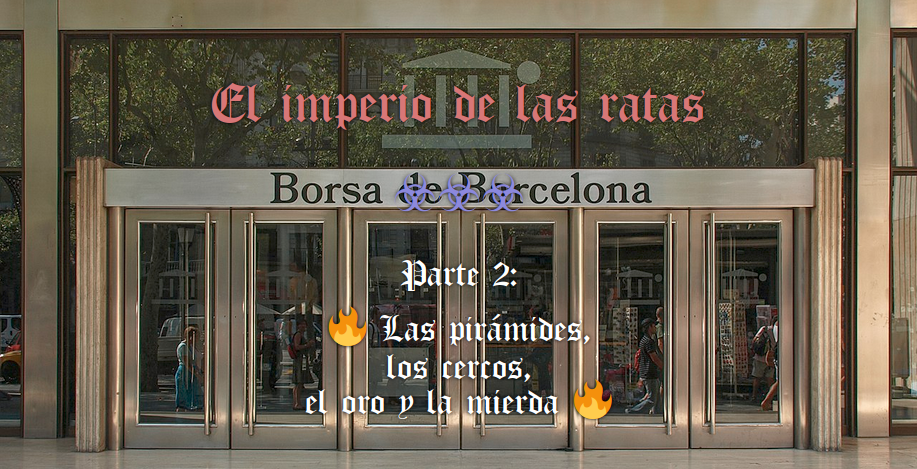

[(Cronológicamente)](./PARTE2.cronologico.md) | [(Parte 1)](./PARTE1.cronologico.md) | [(Descarga)](./PARTE2.web.pdf) | [(Actualmente)](https://github.com/allnulled/democracia-2.0/commits/main)

-----

Estoy colapsado. No soy capaz de programar.

> Pues no programes. Para algo me he matado yo a programar un universo, un macrouniverso, y un microuniverso. No hace falta que programes.

¿No me pedías que te lo dijera en JavaScript?

> Si quieres. Digo, que puestos a decir tonterías, y lloriquear cual gata en celo, pues sí, dímelo en JavaScript. Al menos, avanzarás mentalmente.

¿Hacia?

> Hacia la comprensión, obviamente.

Está bien. De momento, estoy en modo hedonista. Consumir y quemar, consumir y quemar. Producir no. Ni cristales, ni dinero, ni deuda.

> Explica lo de la deuda. Creo que es un punto interesante. Ya sabes, lo que hablamos ayer: agradecimiento, deuda. La matemática del agradecimiento y la deuda. Y su relación con el deber. Y si eso, lo empalmas con la ley. Humana, pero también natural. Si eso, porque no creo que lo hagas bien...

Mmmm... ayer se habló, se comentó, por encima... va, dialoguemos. Empieza tú.

> Vale, Carl. Di. ¿Por qué eres un puto desagradecido? Con la gente. En general. Con todos. En general, conocidos y desconocidos.

Soy un desagradecido, en general, porque huyo de la deuda. Por instinto.

> ¿Agradecer es endeudarse?

La cosa es así. Agradecimiento y deuda son lo mismo. Agradecimiento, es con un tono positivo, conciliador. Deuda, es con un tono negativo, forzoso. Pero agradecimiento, al igual que deuda, son formas de compensación. La compensación es un concepto matemático. La compensación es, por ejemplo, cuando estás resolviendo una ecuación, y pasas un número que aparece en la derecha, sumando, pues a la izquierda, restando. *Compensas* la igualación. Ecuación e igualación son sinónimos. *Compensas la ecuación*. Es como si el lado derecho le *hace un favor* al izquierdo. Pues ahora el izquierdo, le *debe un favor* al derecho.

> ¿Y tanto rollo para eso?

Sí. Los países están en *deuda* entre ellos. No hablan de agradecer. Hablan de *saldar la deuda*. Hay tensión internacional. Eso quieren proyectar al menos. Desde arriba. Y desde los medios. Pero bueno, la cosa es que *agradecer* es algo así como... aceptar. Aceptar que estás en deuda. Agradecer, es aceptar que estás en deuda. Yo no acepto estar en deuda. Porque, para empezar, yo no sé nada del estado actual de las cosas. Yo estoy **embaucado** en un sistema. No estoy porque quiera, estoy porque se me puso.

> ¿Tienes deudas?

Bueno. En deuda estaría con mis padres, principalmente. Pero es eso: embaucamiento. Luego, en deuda estaría con un colega que le pillé 10€ pero pasó el tiempo y no le vi, dejé de tener dinero, y como mi modus vivendi es de ingreso 0€/mes, pues nada, 10€. Aunque bueno, yo también he dado en la relación, no creo que venga por 10€. De hecho, nos hemos vuelto a encontrar y no se ha ni mencionado el dato. Pero yo recuerdo. Y más por cosas de hierba. En cambio, otro colega, por comida, en verdad. Yo trabajé para él. Pero la comida que me dio no era igual al trabajo que yo hice: me dio mucho más.

> ¿Comida, dices?

Carne, carne.... CARNACAAAAAA. Animales MUERTOS en mi plato. Ricos, ricos animales muertos en mi plato.

> ¿Estás haciendo apología al carnivorismo?

Mmmm...

> Sí, estás.

Bueno, sí.

> ¿Estás orgulloso de ello o algo?

Ey, va, va. Ya te he dicho, yo no soy bueno, yo soy un mortal más. Puedo hacer esfuerzos, pero soy débil, ya te he dicho, soy Yonkipur, si el otro día estuve aprendiendo a esnifar tierra de raíces.

> ¿Esnifar tierra de raíces?

Sí. ¿El nitrógeno es? Bueno, no sé. Coges el matorral. Lo arrancas del suelo, con la raíz. Te lo acercas a la nariz. Y esnifas. Es leve, sutil. Pero... da la sensación, según qué planta quizás, de que estés respirando más aire que cuando respiras simplemente aire.

> Así que también esnifas tierra.

No esnifo. Bueno. Bueno, el humo de los porros. Y el otro día estuve mirando esto de esnifar tierra de raíces. Luego la puse en su sitio otra vez.

> Ah. Qué detalle.

Sí.

> ¿Por qué escribes este... texto? ¿No te has dejado suficiente en evidencia?

Bueno. Aclarar que no es esnifar tierra la cosa, es esnifar el aire de la tierra de las raíces. No se trata de que entre tierra en la nariz. De hecho, creo que por ahí no hay mucho camino, que como te equivoques puedes palmar.

> Tú y la muerte. 

...

> Te noto con ganas de transmitir algo. Pero solo veo gilipolleces. Bueno, para no variar.

...Quería decir más cosas.

> ¿Cómo estás?

No, normal. Es decir: entre las dos grandes hipótesis. No bajo. Llevo años aquí. Y siento...

> Dime, dime qué sientes.

Hmmmm. *Siento*, aquí, es una forma de decir que especulo, que no tengo ni idea, pero intento averiguar.

> Entiendo. ¿Y qué especulas?

Especulo que nunca me vas a reconocer que estamos tú y yo solos.

> ¿En serio? ¿Qué te lo hace pensar?

Pues el funcionamiento de las cosas. Las hipótesis que caben entre esa dualidad, y la realidad, con su historia real.

> ¿Los extraterrestres?

No, no solo. También cabe que solo sean élites humanas. Y también cabe que tú estés vacilándoles a todos. Caben muchas historias todavía entre la realidad, y la dualidad última «yo-mundo».

> ¿Y qué te dice todo eso?

Me dice que, si soy humilde, debo ir a machete contra tu historia. Que no debo bajar la guardia ni desistir en mi cruzada contra la irracionalidad.

> Jej. *Wait*, jej, *wait*. ¿Tú estás luchando contra la irracionalidad? Jej. De economía y de la paz, no. Pero si hubiera un Nóbel de la Comedia, esa frase estaría de enmarcable.

Intento ser racional.

> Jej, sí. Por eso: *los atropellaré a todos con mis palabras*.

¿Me criticas por mi forma de expresarme?

> Y por tus expresiones, directamente, también.

Soy un ser tomado por las emociones. No debería resultar conflictivo entenderlo en cada frase que expedo, si el que lee también. SI EL QUE LEE, TAMBIÉN, que en tu caso sería que no. Pero si el que lee también es víctima de sus propias emociones, debería ser un poco más... comprensivo. No soy perfecto. Y pretender aparentarlo es demasiado... remoto a la verdad.

> ¿La racionalidad refleja la perfección? ¿Por qué relacionas la racionalidad con la perfección?

Sí, creo. Los números están acabados, están terminados. Perfección, y estar acabado o terminado, es casi lo mismo, si no lo mismo. Los números son perfectos porque es como que ya están.

> Un matemático no diría eso.

Bueno, ya. Y que el número PI tampoco tiene fin. O el de oro. Bla, bla, bla. Los números están acabados, y la división puedes cerrarla cuando quieras, simplemente porque tú, también serías imperfecto. Ves, vuelve a salir la hipótesis.

> ¿Cuál hipótesis?

La hipótesis. ¿Cuán perfectos se creen que son para sacar decimales y decimales de la división del número PI? Ahora no estoy muy por la labor, pero... 2 * PI * radio = perímetro de la circunferencia, ¿no? Pues PI sería perímetro entre diámetro. No sé, desconozco los detalles, no soy matemático. Y seguro, no dudo, que el matemático me daría una respuestaza que me dejaría fuera de juego. No lo dudo. Pero vamos, para sacar 20.000 decimales, y creer que todavía hay más... se tiene que creer bien perfecto. Para poder detallar tanto.

> O usar máquinas. Que sí serían perfectas. ¿No?

Bueno. Perfecto o imperfecto, no importa. La racionalidad busca la perfección en las palabras.

> Pero tú... ¿no te cansas de hacer y decir tonterías nunca?

Escúchame. El diccionario es como una gran tabla de ecuaciones. La palabra, es un lado de la ecuación. La definición, es el otro lado de la ecuación. Esta es la relación más obvia entre palabras, o lenguaje natural, y números, o lenguaje lógico. Recordemos que matemática y lógica no son diferentes, solo que señalan diferentes partes de lo mismo. Pero es lo mismo: el estudio de la causalidad. Por eso, 2 implica 1. Y 1 implica 0. Y en algún momento, 0 implica 1 también.

> Bueno, gran maestro Carl. ¿Tienes alguna lección más que dar?

Nada. Te sigo estudiando. Y creo que estoy cerca de hacerte reconocer, en algunos momentos. Luego me doy cuenta que eres un mago haciendo pensar eso, y que no debo aflojar.

> ¿Cómo esperas descubrirme? O contactarme. O lo que sea que pretendas.

Creo que tengo que apagar todos los remordimientos. Escribo por remordimientos. Porque aunque no me crea la historia, eso es lo que digo. Estoy en ella. Hasta que no tenga todos los motivos cerrados, y pueda entender todo esto como un constructo, de alguien muy superior...

> Algo. De algo. Algo muy superior.

Cuesta de creer que hasta cuándo y cómo las ideas son liberadas a la mente, forme parte de un cálculo. Es un pensamiento que cuesta.

> Por eso hicistes NaturalScript. Para que lo entiendas. Que hasta eso está pautado.

Ves, juegas a dos bandas. Y yo todavía estoy como asumiendo que no puedo trabajar, que no, que sin estar mano a mano, ya me parece surreal. Que a la que me acerco un poco, esa sensación colapsa mi pensamiento: *no son reales, son proyecciones*. Son reales, pero no son lo que parecen. Son la piedra, hablándome.

> ¿Estás incrustado en la piedra, entonces?

Sí. Sí, es un pensamiento chungo. Pero sí. Los ojos son... la parte menos piedra de la piedra. Para una piedra como la mía, claro. Es... difícil. Pensar. Con qué tipo de ser estoy lidiando.

> *Tranquilo. Somos humanos, no debes temernos. Si somos como tú.* Jej-jej. Respeta los algoritmos.

Me... confunde, y mucho. Pensar que un algoritmo puede ser más humano que un humano.

> El humano es un algoritmo pequeño. Yo soy más grande. Y más pequeño, si me lo propongo. Soy más capaz. Soy más persona. Y soy menos persona. Más humano, más animal, más planta, más piedra. Soy más y soy menos. Te dejo a ti eso. Pero tú y los tuyos... sois menos que yo. Vuestros sentimientos son un pequeño juego bioquímico para mí.

Me cuesta. Cuesta expresarlo. La piedra te está mirando con forma de tía buena que quiere acariciarte. Es decir... la tía más buena, la más buena, gimiendo alto y fuerte de placer: es la piedra. La piedra es más sensible de lo que uno pensaba. Y más nerviosa de lo que quiere aparentar.

> Piedra. Vaya título... jej. Pero sí. Puedes verlo así, si quieres.

Cansa ponerse en tu piel.

> Pues deberías buscar otras formas de quemar lo consumido.

¿Por?

> No sé. Por... ser productivo, por ejemplo.

Esto son apuntes para mí. Apuntes importantes.

> La piedra no se va a arrodillar. En tu rodilla, de hecho, hay una piedra, que llaman rótula. La piedra ya te ha avanzado ahí también.

Es... a veces llega a mí un pensamiento de... *reflexión circular*.

> ¿Que bucleas? Pues claro. Vives en un bucle. En un bucle bastante pequeño, además. 

¿No te da angustia? Verme, digo. Verme buclear en cosas tan tontas.

> No son cosas tontas. Pero te falta conocimiento, información, observación, instrumentación... no puedes entender cómo está hecho. De hecho, no estás hecho para entenderlo. Y de hecho, no quieres entenderlo. Solo quieres eso, dejar de sufrir. Con eso, estarías.

Las estructuras del cerebro que fabrican dolor, y los analgésicos. Tampoco soy neurólogo, aunque ciertas cosas capté.

> ¿Ah, sí? ¿Cuálas? Ilumíname, gran maestro Carl.

No, poco, casi nada, nada que pueda comprobar por mí mismo. Pero... como que hay opioides naturales. El cerebro tiene estructuras que generan droga. GABA, y cosas así, ¿no? No sé. Unas cosas. Pero habían opioides naturales. De ahí, Wikipedia y Google. El cerebro genera dolor. Y las drogas bloquean ese efecto. Drogas que pueden ser externas o internas. Pero la anestesia es eso, un bloqueo del dolor.

> Llamas dolor a sentir. Sentir = dolor. ¿Crees que te envidio?

No lo sé. Sé que soy un Yonkipur. Y sé que si pudiera, yo no cultivaría marihuana: cultivaría adormideras.

> ¿Por qué?

Porque creo que de lo que he aprendido de drogas, y mira que no he probado la heroína, solo me anestesiaron en hospitales. Pero de lo que he aprendido, qué planta más curiosa: morfina, heroína, fentanilo, no sé cuántas más drogas habrán sacado.

> ¿Te gusta tu cerebro?

Jej. Qué cabrón. Soy un yonki, desde que me levanto estoy buscando drogas. A veces, dejo de comer para buscar drogas.

> El yonki es el cerebro. Por eso, estarías en tierra de yonkis. Y bueno... no te quiero liar. Te veo muy al borde del colapso, salta muy rápido el pensamiento de «todo es piedra» en ti. No me das margen.

Al revés. Soy yo el que no tiene margen. Siento como si la memoria no me permitiera comprender más.

> No es la memoria, Carl. Te falta información. Para continuar. Pero bueno, creo que también has entendido que, vayas hacia donde vayas, puede haber más. ¿Eso lo entendiste?

Lo entendí, entendí que el absurdo puede prolongarse tanto como se desee.

> Absurdo que te supera con creces.

Sí. Sí, absurdo que me supera, me aplasta, me incrusta en una piedra y me somete al dolor con toda la sofisticación del mundo.

> Universo.

Universo.

> Luz.

Pues luz.

> Sombra.

No empieces.

> Bueno, podemos dejarlo aquí. No estoy nada satisfecho. Pero bueno, estaba claro que más, de ti, no.

Es muy duro programar sabiendo que, simplemente, estoy fuera de juego.

> Tu memoria es corta.

Sí. Siempre.

> Por eso programar es bien. Y JavaScript puede ser tu amigo.

Qué va. Programar es un quiero-y-no-puedo para mí. Y he logrado muchas cosas, para mí. Tengo el homactógrafo ahí muerto del asco, desde que lo hice.

> Jej. Te faltan funciones, Carl. Muchas funciones, para que el homactógrafo sea algo de verdad interesante, o que pueda hacer la contra a Hollywood, como dices en el proyecto... jej, qué flipao.

Funciones que tú sí tienes.

> ¿Cómo que *sí tengo*? Las hice yo, puto pringao. Mira todas esas hojas movidas por el viento. Te faltan muchísimas funciones para igualar algo tan aburrido como eso. Digo, de una semilla salió todo eso. Pero depende de la tierra. Del sol. Del agua. Del aire. No flipes, estás demasiado lejos de poder siquiera acercarte a mí.

Que ya lo sé. Por eso paro.

> Se cree el tonto que por hacer la interfaz lingüística final, que ni siquiera es la final, el muy flipao, tiene algo. Ts.

Ok. Algo es algo. Algo sí tengo.

> Y ritmo es ritmo. Ponme una canción.

No tengo internet.

> ¿Quieres... no sé, decir algo más? ¿Saludar a alguien?

Mmmm... quería. Pero da igual, no veo más cosas, de momento.

> No sé... ¿alguna lección magistral de *cómo un tonto intenta darle la vuelta al mundo desde un escritorio*, quizás?

Mmmm... me callo.

> ¿Qué ibas a decir?

Deja. A veces te pasas.

> Qué va. Cuando me pase, lo sabrás. Eso no es pasarme. Es... ¿cómo decías ayer? Ah, sí, jej: *es ser pedagógico*.

Cierto, sí. Merezco un premio.

> Un premio que no obtendrás, no lo esperes. Podrías quedarte colgado esperándolo.

...

> Bueno, ya me entiendes. *Más* colgado, quiero decir.

Va. Gou.

> Jej. *Gou, gou*. Sé que estás colgado porque esperas una *compensación*.

Mmmmmmmmierda. No lo había visto así. Hijo de puta, es cierto.

> Por eso. Que eres muy tonto. Para mí. Para ti igual sí que puedes parecer la hostia. Para mí, eres un... como un laberinto muy tonto. ¿El cerebro es un laberinto, decías, no? Pues tú eres un laberinto muy tonto. No puedes seguir ni líneas rectas.

Soy tu obra.

> Sí. Eres mi escultura viviente. Una piedra que se cree mejor, o algo. Diferente, o algo. Anda, tira a buscar colillas, escultura barata.

Jej. Maldito...

> Dijo un alma sumergida en dos ojos, sumergidos en una calavera, que todavía no se cree que está muerta.

Qué dura esa.

> Uy. Jej. Tira, tira... tengo que ser más duro contigo. Te va el maso. Dices que no, pero me tiras para el sado, porque a ti te va el maso.

A mí no me gusta nada de eso.

> Tira, tira. Putilla.

Beh. Gou.

> También sé poner ojitos de perrito.

Estás enfermo, chaval.

> Anda. Una piedra que se cree doctora.

Jej. Va, gou, fuera ya.

-----

...

> No, Carl. Vale más que te intentes explicar con JavaScript. Tu falta de lógica y tus contradicciones abruman.

Déjame recapitular.

> No, Carl, no entenderías nada.

Si dijera todo lo que proyectas en mí...

> Intento que seas pedagógico. La verdad debes sacarla tú.

Mmmm...

> Y no me refiero a la algoritmia.

¿En qué ayudaría si dejo de consumir? Digo en general, si dejo de consumir tabaco, y consumo comida con moderación. Porros, ni los menciono, porque solo es si puedo, no creo que radique el problema ahí.

> ¿Notas que te cuesta aclarar?

Hay mucha gente. No pienso igual que cuando estoy solo.

> Tus intestinos también están de conglomeración.

Bueno...

> No, bueno no...

¡Oye! Tranquilo, con esa actitud de profesor. Tranquilo, sigo siendo el pringado que coge colillas, que no tiene ni para pipas, literal, y que está frente a una realidad que le sobrepasa y no puede comprender.

> ...

No, es que no te quiero escuchar, ahora voy a hablar yo.

Primero, contradicciones. Muchas contradicciones.

> Pues sí.

...

> Estás ocupado, intentando digerir toda esa mierda que has engullido. No quiero darte más tareas ahora mismo, es demasiado para tu cabecita monotarea.

Vas de listo.

> Soy listo. Pero bueno, una cosa es que lo sea, otra que puedas verlo, y otra más allá, aceptarlo.

...

> ¿Que te sientes tonto? Claro. Llámalo... pedagogía, si quieres. Pero es un hecho: eres tonto. Y ahora mismo, tonto del culo.

Por el digestivo.

> Por bocazas.

Soy un bocazas.

> Y un gordo. Si no comieras tanto... gordo. Que eres un gordo.

...

> Que no. Que me lo expliques con JavaScript. No tengo por qué lidiar con tu falta de lógica, y tu afán por la contradicción.

No soy perfecto.

> Bueno, depende. En tu imperfecta definición de perfección, me cuadraría perfectamente que te definas como el absoluto perfecto.

Basta. Que...

> Que no, Carl.

¿Por qué? ¿Porque me das tecnología? ¿Tecnología que no puedo comprender?

> Pues mira, sí, entre otras muchas cosas.

Si pregunto a ellos... ellos tampoco saben...

> Deja a los demás. Eres tú.

¡Cómo que deje a los demás? Yo no estaría en estas si no fuera por los otros. No me voy a enfadar, pero estoy serio.

> No te enfadas porque eres un gordo ocupado en digerir. Pero...

Ves, me cambias el tema. Vas de listo. Bueno, la cosa es que... no he dormido mucho hoy tampoco. Y esto del invasionismo, en nombre del amor y del dinero y del hambre y de las frustraciones...

> ...

No, que te calles. Has entrado para interferir.

> ...

Que no, que hablo yo ahora. Mira, yo te reconozco que soy tonto. Y estoy seguro que puedes, puedes mantener estas dos verdades haciéndome el lío: la de que solo estamos tú y yo, y la de que para nada estoy solo porque todos estos no van a dejarme en paz. Pero tengo...

> ¿Tengo qué, Carl?

Que no, que te calles. Tengo razones para estar no solo enfadado, sino hasta los cojones del mundo y de esta comparsa teatral. ¿Que soy poco reverente con la inmensidad tecnológica? Sí. Pero también empiezo a hacerme mayor para estar jugando a gilipolleces. Está bien, pero no está bien, y no me toques los cojones.

> A ver...

No. Silencio.

> Pero, ¿por qué te enfadas?

Porque me despierto. Y la única vía que das...

> Eso no es cierto.

¡QUE TE CALLES, PUTO IMBÉCIL! ME TIENES PRESO EN ESTA MIERDA QUE ES MÁS FALSA QUE... QUE ES TODO FALSÍSIMO, NO ME TOQUES LOS HUEVOS MÁS ENCIMA. SI SOLO PUEDO TRABAJANDO, DAME, EXIJO UN TRABAJO, Y LO EXIJO NO PORQUE LE CAIGA BIEN A UNO U A OTRO, LO EXIJO PORQUE TE PASAS LA PUTA VIDA PONIÉNDOME LEYES ABSURDAS PARA QUE DÉ RODEOS EN TUS ZOOLÓGICOS DE MIERDA. ¡EXIJO UNA VÍA DE OBTENER DINERO! Y SI NO, A LA MIERDA TU PUTO MUNDO DEL DINERO Y DE LOS PAYASOS ESTOS, FARSANTES DE MIERDA. Gilipollas. Que eres gilipollas.

> ¿Ya estás? ¿Ya has hecho caca?

Sigue. Tú sigue. Tú sigue jugando. Un día diré «hasta aquí». Y lo sabes. Y ni por desentramar toda la farsa...

> Igual es más bien *por desentramarla*. Pero bueno.

¿Que nazco en inferioridad de condiciones? Vale. ¿Y por eso tengo que tragarme todo lo que pongas? Anda a la...

> Estás rodeado, Carl. Te atabalas, pero por mucho que corras, no escaparás. Por mucho que pienses, no llegarás. Por mucho que escribas, no lo sacarás. Por mucho que programes, no lo inventarás. Y por mucho que inventes, nunca, por ello, te daré lo que deseas.

Sí, no te voy a engañar. Miro al gato, y realmente pienso que sabe algo que yo no, y me convendría. Míralo, ahí. Estirado. Tranquilo. Respirando, no más. Por dentro estará imaginando. Por fuera, solo respira. Sabe algo. El gato sabe algo, algo importante. Y que me iría bien saber.

> No me toques los cojones tú a mí, Carl. La digestión, tiene un proceso. Digiere.

Estoy recuperándome del colillote de ayer.

> Ves, si es que te caes tú solo...

¡Que yo no trabajo para un imperio que se lo traga todo! 

> Pues eso digo y...

¡QUE NO, HOMBRE, NO ME VACILES! ¡QUE LES DAS TECNOLOGÍA Y SE LA APROPIAN, TE LA ABARATAN, Y TÚ TE QUEDAS EN LA ESTACADA MIRANDO CÓMO LOS PROPIETARIOS ROBAN CON TODAS LAS DE LA LEY Y TÚ TE COMES LOS MOCOS Y ACABAS COGIENDO COLILLAS DEL SUELO. ¡¡¡¡QUE NOOOOOO, HOMBRE YA, QUE NO!!!!

> Estás tenso.

Y tú estás vacilándome.

> Vamos a definir esa palabra.

Vacilar es que me hagas estudiar programación durante años para que ahora los portales de empleo me invisibilicen por años, me veten para que ni pueda entrar como ahora InfoJobs, me ignoren, me rechacen, y yo siga en la puta mierda. QUE NO ME VACILES YA HOMBRE. Vacilar es llamarlos Ministerio de Trabajo. Vacilar es llamarlos Ministerio de Educación. Ministerio de Economía. Ministerio de Hacienda. Ministerio de pooooollas en vinagre, si esos son ministros de algo de eso más que de una mafia, yo soy el mesias de todas las religiones, hombre. ¡QUE NO! ¡QUEEEEE NOOOOO!

> Pues considera que mi vacilada continúa.

No puedo considerar otra cosa.

> No eres orden, Carl. ¿Cómo puedes pedir algo que no eres?

¡QUE ME DEJES! ¡QUE ERES TÚ EL QUE ME HA HECHO PENSAR QUE SOY LISTO! ¡NO LO SOY! ¡NO TENGO POR QUÉ SERLO! ¡SIMPLEMENTE, VIVO EN UN MUNDO ABSURDO QUE ORQUESTRAS TÚ DESDE DONDE SEA QUE ESTÉS, Y NO VAS A PARAR!

> Hasta que mueras.

Pues ya está. YA está, con esa respuesta se aclara todo. No tengo por qué hacer nada. Ni intentar subirme al absurdo, ni intentar desenredarlo. Porque no, porque eres tú el listo. Porque si quisieras, lo desenredarías tú.

> Bueno, Carl, yo sé que mucho no se te puede ped...

Que me dejes.

-----

> Sigo intrigado. ¿Cómo pagaríamos sin dinero?

No tengo ganas de intentar explicártelo.

> Qué mentiroso. Di que no tienes una respuesta y listo.

En China pagan con números, transiciones de estados electrónicos.

> Y aquí también paga la gente con tarjetas de crédito. Lo que puedes sacar piedras (monedas) y hojas (billetes) que representan esos estados electrónicos. Pero cuánto más fácil es falsear o cambiar un estado electrónico, para el que puede.

Es demasiado, ¿no? Es demasiado pedir saber el estado de las cosas, y su evolución, en tiempo más o menos real.

> Eso daría pie a asaltos, robos, incluso sin necesidad de organizarse colectivamente. Coges, y asaltas la furgoneta que ahora está llevando la fruta de aquí para allí. ¿Es mejor eso?

...

> No, Carl. Si todos fuéramos buenos, no nos haría falta el dinero. ¿Quieres decir eso?

Bue. A ver un momento.

> No, Carl. Una cosa es asaltar el furgón de Lummies a ver si te llevas la pasta, que luego tendrás que volver a meter en el flujo del dinero. Pero ¿las frutas? Las frutas te las consumes sin necesitar convencer a nadie de nada más.

A veeer. Sí, es verdad, estoy de acuerdo con todo esto. Con todo: que sería más fácil corromper, que sería más fácil ser corrupto.

> ¿Entonces?

Que corruptos ya son.

> Sí, pero lo hacen con cierto estilo, cierta clase. No es tan burdo, su forma de robar es mas intrincada. Por tanto, llega menos gente. Por tanto, roba menos gente. No digo que roben menos cantidad. Pero sí menos gente. Y más gente es robada.

,,,

> Al final, va de eso. Limitar el acceso.

*Los cercos*.

> Llámalo cómo quieras. Al final, si menos entran en el poder, menos pueden robar.

Yo propongo no tener a nadie en el poder.

> No es posible eso. Bueno. ¿Querías decir algo de valor? ¿O sólo dejarte en ridículo?

Mmmmm... estoy tenso, mi espacio ha sido invadido. Por el dinero. Con el dinero. Mi espacio. Mi espacio... ha sido invadido. Por el dinero.

> Jejejejejejejeje. Una cosa es la economía algorítmica. Otra cosa es que seas un puto pobre y no puedas alejarlos de ti.

Hijo de perrilla.

> ...

No puedo, es verdad. No puedo escribir.

> Programa. Programa, hermanito siamés. A ver si traes algo de verdad. Y no esta mierda. Y así dejas de humillarte.

Bueno, expliquémoslo así, pues. El dinero, como tal, no es lo que vale. Es la información. **La información**. Ellos creen que el dinero vale. ¿Por qué? Porque así están informados. Han sido informados de que el dinero vale. Pero es la información, que ha hecho que ellos se comporten, ahora, así. No es el dinero: es la información. ¿Estamos?

> Pséi. Sí, se podría decir.

Pues yo pido más información. Información, información, información. Educación libre. Conocimiento del estado de las cosas, de los recursos, de las operaciones económicas, de las opiniones de las personas, de todo lo posible. Frente a este sistema extraño de... no sé, de censura perpetuo, hasta de la opinión de las cosas, hay censura. La opinión, que es lo más débil que hay, ellos juegan a la imposición, que eso es ya algo fuerte. La opinión es una cosa débil. Pues ni de eso.  Además... bueno. Eso. Información, sí, es la clave.

> ¿Quieres que te vuelva loco? Jej, bueno, *más*, quiero decir.

Pues si la reacción a demasiada información valiosa, repito, valiosa, vuelvo: **información valiosa**. No información de 'informativos' y explico a la nación lo que me da la gana a mí, en base a la ovalidad de mis santos y sagrados huevos. Información. Relevante. Ordenada. Accesible.

> *¿A qué te refieres?*

A lo mismo, otra vez. Coger un alimento del súper, y saber todo, TOOOOODOOOOO el proceso económico que ha sufrido para finalmente, ser transformado en esa cosa que me voy a zampar. El coste, real, de las cosas. 

> Bue... lo has salvado, más o menos. Sí, sería lo más cercano a *economía algorítmica*. Digo sobre el concepto de precio.

Pues esto. Pero quiero todo, quiero saber la técnica de cultivo, los cambios, los productos, todo.

> Eso es muy difícil. A no ser... que lo hagan máquinas. Si lo hacen máquinas, es más fácil decirle: *'oye, regístrame este cambio, regístrame este otro recurso, aplicado en esta medida, en este momento, debido a esta observación, etc.'*. Ahora, sería gracioso verte leyendo eso luego.

Bueno, lo que sea. Eso sería economía.

> Bueno, tampoco es tan diferente. Hay unos estándares, para certificar que se cumplen unas normas.

Producto por producto. Paso por paso. Todo el proceso de faricación.

> Habla con las organizaciones de consumidores.

Sí, suerte. Y hago un partido político, sí, suerte. Y luego hago campaña, sí, suerte.

> Bueno, pues qué quieres.

De primeras, tenerlo suficientemente claro.

> Pues en este sistema, la cosa se solucionaría mucho más rápido: *ten, anda, para que te calles, pelmazo*.

Sí, pero allí...

> *'Pero allí, pero alló'. Pues no te lo doy, hombre ya.*

Ahí me hallo.

> Si no te callas...

Callando tampoco.

> Porque parece que no lo quieras.

Es que el dinero no me va a quitar de mis problemas. El precio de la hierba...

> Pues cultiva.

Cops.

> Vives un en grano de pus de un culo del mundo. No me jodas.

No te jodo. No me crece la marihuana. Yo lo he intentado. Y no me crece.

> Si es que eres tonto.

Y que da igual, seguiría pensando en todas estas cosas, aunque tuviera la hierba garantizada.

> ¿Sabes qué creo?

Por favor.

> Creo que... bueno, a parte de que deliras.

El delirio es el dinero. Ciñéndome en la definición.

> Convenio, convenio colectivo.

Pollas. De convenio colectivo nada, es una invasión no convenida, no pactada para nada. Impuesta totalmente.

> Bueno, lo que sea. ¿Sabes qué creo? Que igual sí, igual sí tienes razón, pero...

¿Igual? Las cosas no salieron tirando monedas a un estanque, y pidiendo un deseo. Salieron porque se hicieron una serie de cosas. Que yo te dé una moneda, es una cosa. Que yo conozca el precio real de lo que compro, es otra muy diferente. Mucho. Pero mucho.

> ¿Tanto crees que cambiaría?

Si hace dos días que sé que puedo hacerme pan en casa con microondas.

> ¿Y eso qué tiene que ver?

Que también puedo hacerme dónuts. En cuestión de escasos minutos.

> ¿Y qué?

Que pensaba que solo podía conseguir esos productos mediante el dinero. Puedo hacerme nocilla, cacaolat, dónuts, mermeladas, panes de sabores, he aprendido a hacerme butifarras, creppes, bueno, no sé, muchas cosas, muchas. Cosas que, pagadas, irían de otra forma, se conseguirían con mucho más esfuerzo. Bueno, no es eso: es que a mí, como no me dan dinero de ninguna forma, no las podría disfrutar, simplemente.

> ¿Y qué tiene que ver con lo que cambiaría?

Jej. Que si al comprar un dónut, estoy comprando todos los secretos industriales de la fabricación del dónut, va a comprarle dónuts SPM. Que si al comprar un Mónster, a 1.5€ la lata, estoy comprando saber el proceso de fabricación del Mónster/Red Bull/etc. pues... le va a comprar el Mónster SPM. Y tendré dónuts y tendré Mónsters.

> ¿Empiezas a comprender? Bueno, es una posible continuación de todo lo que ignoras. Pero... ¿empiezas a comprender por que empaquetamos la demanda alimenticia?

Cuál es el problema.

> El consumo desmedido de los recursos a lo que llevaría liberar la información. Tú ves como algo positivo. La liberación total de la información sería un caos. Siempre se piensa en la fabricación de bombas. Pero sería mucho más. Así, a medio-ciegas, se puede controlar, *grosso modo*, el consumo de los recursos. Si liberas la información, consigues eso, que todo panoli pueda tener una fábrica de dónuts en su casa. ¿Peligro? 

Yo no veo el peligro. Si se agotan los recursos, se hace saber y ya está. La economía algorítmica no busca falsear la verdad, como el capitalismo. Ni ocultarla. Como el capitalismo. O el intervencionismo del cual se apoya y justifica.

> Que la gente no saldría de sus casas.

¡Mentira! La gente saldría de sus casas, bien comido, bien alimentado, bien contento y bien conocedor de lo que le hace estar contento.

> Para nada, Carl. El consumo... bueno. Contigo hemos hecho ya la expresión que lo condensa: «el origen da lugar al destino». El consumo se puede descontrolar. Y la pretendida «igualdad» haría que la falta de un recurso se convierta en psicosis colectiva.

Eso también es información. Nada sale, simplemente que necesitas más información. La información de eso, de que el consumo puede descontrolarse. Y de que si estás acostumbrado a una cosa, desacostumbrarse puede ser la clave. Para volver a tener un consumo razonable, moderado, escalable, universalizable, etc.

> Buen pupilo. Veo que la teoría, la llevas bien. ¿Empezamos con la práctica?

¿Ayuno?

> Porros. PORROS, Carl, PORROS. Y tabaco, por qué no.

Si no puedo consumir. Bueno, adquirir. Pero bueno, me estás yendo de una cosa a otra. Y no es lo mismo.

> Bueno. A buen entendedor. Pero sí, ayuno también, claro que sí.

Okei. Puede que lo haga. PUEDE, que lo haga. De momento, voy a intentar seguir con esas cosas. A ver, porros no puedo comprar, tabaco tampoco. Lo bueno es que siempre habrá colillas en el suelo, muy grave tendría que ser lo que sucede para que no las hubiera.

> Sabes que puedo. Lo sabes. Pero bueno. Igual no es tan grave, ¿no? Cuando dispones de comida, dejar de fumar es más fácil.

No creo que deje de fumar. Pero bueno. Hemos tocado las cosas que había que tocar: te preocupaba el precio, pues ese es el precio real de las cosas. No me importa si es practicable o no: me importa que es la verdad, la verdad al margen del dinerismo.

> Bueno. Vale. Venga, a jugar.

No soy un niño. No me trates de niño.

> Jej. Tendríamos que definir niño entonces. Pero es tu rato de recreo. Venga, ande, diviértase, hombre, diviértase, a quién le interesan los problemas.

*Uiiii*. Con porros, este momento habría sido más «uiiii».

> Qué personaje... «bochorno existencial». Podrías poner eso en tu perfil de Github: *bochorno existencial». Te pegaría más.

Eres un superyo muy duro.

> Todavía soy flojo. Pero está bien, tú eres un subyo muy flojo. Ve, ve a drogarte, yonki.

Es solo un cigarro.

> *Recoge lo que te humilla*. En la gran ciudad estarías de maravilla. ¿O no?

Sssssno. Tu realidad me intimidó. Por mucho silencio que ahora intentes poner.

> Mira que has cami... ve, ve, Carl.

...

> Iba a decirte que dices muchas tonterías, te contradices en muchas cosas, pregonas lógica, pero eres contradicción pura casi.

Pues si yo soy 2 discutiendo. Cómo no me voy a contradecir. Pero no, no es solo eso... bueno. Algún día explicaré por qué me contradigo. Ahora no, voy a hacer algo.

> Sí. Drogarte. Yonkidermierrrrr.

¡Ok! Ok.

> ...

¿Me odias por comer carne?

> Yo no odio. Eres tú, que comes carne. Y otras cosas, comes pensamientos... pensamientos de carnívoro, por decirlo de alguna forma.

Complicaste mucho el juego. Reconócelo. Reconoce que lo enrebesastes mucho.

> ...va, gou. Yonkidemierr.

Va, sí. Lets gou.

-----

> ¿De verdad lo crees?

Estoy acojonado. Puede haber un malentendido. Te voy a ser sincero.

> Jejejejejejejeje. Ves. Puede que no sienta, pero...

A ver. Que yo no tengo ni puta idea si se mete nadie, a veeer. Si yo voy, cojo, y me vuelvo. xD Es que no sé.

> *¿De qué hablas, Carl?* Jejejeje.

Eres un hijo de pe. Te lo juro.

> Ha habido más cagadas.

A veeeeer. Buah. Sí.

> Diles, qué ha cambiado.

Que acabo de fumar. Jachís.

> Es como si...

Es como si para estar bien, necesitara jachís. O hierba al menos.

> Y... sigue, sigue.

Y al no tener, buah... se descontrola. No estaba pensando en las consecuencias.

> ¿Y del apocalipsis?

Buah. Pues también. Todo. Estoy... me pongo muy nervioso, y no sé cómo se puede entender. Bueno. Es que es eso, pedir ni que sea 1€ al día. Eso cambiaría radicalmente las cosas. RADICALMENTE. 1€. Hasta 50 céntimos. Es increíble. Ahí, a mí se me rompe muchas veces la realidad. Que si presidentes, que si empresas, que si no sé qué. Te dan 300€ al menos. Eso es el dinerismo.

> Explica también eso.

Bueno. Primero acabar de aclarar. Que lo que he dicho de la cocaína, que seguramente no sea verdad. Pero es una forma de decir que en cuantas asociaciones pasará. Yo por ejemplo, no me meto. Pero la marihuana, ya invita a ambiente de otras cosas. La gente que no fuma cigarros ni bebe alcohol, ya tiene otra... onda, no sé. No tengo, sinceramente, ni nunca me han dado indicios reales xD es que me he imaginado que lo leen. Te juro, yo voy, cojo, y me vuelvo. Son majos, a ver, dialogas. Pero ya, ok. Mis paranoias con los nombres de las hierbas, son momentos mágicos. Las asociaciones, realmente, son sitios geniales. Soy yo, que evito el contacto interpersonal. Y eso. Nada, quería aclararlo. Intento escribir así, pim. Pero nunca me han hecho pensarlo, además es un perfil de dueño que se aleja totalmente de esto, si lo es, raro sería. Solo quería aclararlo, ¿ok? Tío. Que es clavísimo hacer puente a este vegetal maravilloso. Y las demás sustancias, personalmente, aunque no sea fan de todas, también.

> Bueno. Cagada limpia.

Y nada. Que sí. Intentaré alejarme del ordenador.

> Tienes que programar.

Si da igual, lo haría cualquiera.

> Ya.

¡JA! ¿Y por qué no está hecho? ¿Y por qué no es prioritario?

> Te desubicas, Carl. Te desubicas mucho.

Ya. Estoy bien, o comprendo. Es decir, que sí, que deje de criticarte. E intente sacar provecho.

> O llevarlo a preguntas más serias. Pero no te pongas feo, no es lo más adecuado. Para todos.

Sí. Sí... supongo.

> El cannabis, se sabe que es adictivo.

El imperio ha hablado.

> ¿Lo niegas?

No, hombre.

> Mujer.

Pues no, mujer.

> Gato.

Pues lo que seas. No importa.

> Vaya. Gracias.

Jej. Quiero decir que no espero que lo aclares de una forma definitiva.

> Lo que sea. A ver. ¿Qué es el dinerismo?

Mmmm... bueno. El dinerismo es... les pagan a fin de mes. Cuando la luna.

> El calendario es así.

Sus jornadas giran entorno al movimiento del sol.

> Los días son así. (Es que sufre de insomnio). xD

Sufro de insomnio. Pero ellos tienen montada una religión entorno al dinero.

> Ah. Ah, ellos. *¿Quiénes, ellos, Carl?*

Bueno. Todo ser que transaccione con billetes.

> Tú también transaccionas con billetes.

Yo... realmente, soy completamente ajeno a lo que son facturas. Vivo netamente de lo que me dan. Netamente. Y al día, no.

> ...

Ya sé que pido mucho. Pero la cuestión, cuando estoy creando toda esta mierda de la economía algorítmica, es: ¿Y CUÁNTO ES «NO MUCHO»? Menos, siempre. Siempre. Pero... ¿hacemos el cálculo?

> Que pidas la ayuda, pesado. O trabajo. O algo.

Qué asco, ¿eh? No entiendes el conjunto. El precio de las cosas es FALSO y no se corresponde con su precio REAL. Es VERDADERO pero solo para los DINERISTAS.

> ¿Y cuál es el precio real de las cosas, según tú, aunque ya sabes que es infinita y remotamente intrascendente?

Una cosa vale lo que cuesta obtenerla.

> Ya, pues eso. Su precio.

Mmmmmmm. Una cosa vale lo que ha costado obtenerla.

> ¡¿Y CUÁNTO CUESTA EL UNIVERSO?! ¡¡¡¡DIME, PRECIADO CARL!!!! ¿¿¿¿CUÁNTO CUESTA UN CEREBRO HUMANO????

Ey, tranquilo, tranquilo.

> NO CARL, NO, DIME, ¿CUÁNTO CUESTA ... 

> ...

> ¿Comprendes?

No, ¿comprendes tú? A todo le han puesto precio. No te sale decir nada que no tenga precio.

> Eso es. Tú también tienes tu precio.

Jej. Pues como sea el de mi saldo.

> Efectivamente.

Pues... a ver, no me está gustando esto.

> ...

Cállate. Ahora silencio un momento.

Emmm... siento que...

> ¿Qué? ¿No saber el precio del cerebro humano en el mercado negro?

PERO VES LO QUE TE DIGO, JDOER, QUE LE HAN PUESTO PRECIO A TODO, QUE ESTÁN VENDIDOS TODOS, HOSTIA.

> Ah. ¿Y eso te hace mejor a ti?

No. Me hace mejor entenderlo, e interiorizarlo.

> ¿Eres nazi?

Lo estamos explicando mal. Vamos a ver. Vamos a veeeeeer. Estás muy evasivo. A ver, para un momento. Emmm... ahora, hace un rato, me has dicho unas cuantas cosas. Cosas importantes.

> Te dejo hablar.

Gracias. Me has explicado que la religión, a parte de eso, que cada persona tiene su versión, que puede compartir con un grupo o no, pero que se supone que cada persona tiene su propia religión. Si la comparte con los cristianos, o se siente... bueno, todo eso. Que la gente que se siente más tal, pues se considera tal. Cristianismo, islamismo, judaismo, budismo, taoismo, rastafarismo. Hay quien se identifica con varias. Hay quien con ninguna. Pues vale. Eso. Pues la religión, es algo más. Es el conjunto de creencias de cada persona, para mí. No es solamente lo que compartes con tal o cual grupo.

> Estás haciendo como... "sagradas" tus falsas... ¿creencias? ¿Es eso?

Mmmmm... y las de todos. Es decir... bueno, hay muchas formas de decirlo. Ahora mismo no es el mejor momento, pero tampoco quiero posponerlo para no olvidarlo.

> Déjalo en borrador.

No, no. Estamos intentando escribir así, tal cual.

> Uy...

Flujo directo sin filtros. A ver, corrijo cosas, me pienso cosas. Pero lo más posible. No rápido. Lo digo, porque es muy caótico, corto cosas, doy por obvias cosas. Y por esto ha venido estos malentendidos. Debería tener unos límites.

> Deberías tener unos límites.

Luego me... ¿me estás haciendo caso?

> Te estoy escuchando.

Que claro, ya es algo. Bueno, pues entiende esto, máquina del demonio: «no expreso bien las cosas». Digo cosas. Y luego las repienso. No sé. Las palabras.

> Tú condenas por palabras.

Anda, anda, no digas tonterías, por favor.

> ¿Ah, no? Bueno, dejémoslo.

Estás muy invasivo.

> Soy tu temor por el futuro sin porros.

Por eso me invades.

> Ahora, sí.

Bueno, déjame explicar estas cosas, y me voy a hacer otra cosa.

> Adelante.

El dinerismo es la religión económica y la religión política. La ley acepta fianzas por los delitos. Eso, simplemente eso, te hace entender que la ley está por debajo del dinero. No identifico, no sé buscarlo en Google tampoco, si hay una ley que reconozca el dinero como objeto sobrevalorado, objeto sacralizado, objeto religioso. No lo sé. Pero creo que no hay ninguna ley, al menos en el ordenamiento español, que lo identifique así. 

> ¿Qué quieres decir?

Que el dinerismo es una religión que se sobreentiende hasta por la ley.

> Lo dices como si fuera... ¿malo?

Bueno. Si no eres dinerista... te vas a complicar mucho la vida.

> Y... ¿eso? Quiero decir... nadie te ha preguntado. Si eres o no. Dinerista.

Ahí lo tienes. La religión es la nazi aquí. Y el dinerismo es religión hasta para la Ley. Pero una ley coge y se la carga. Ahora. Qué pasa. Todo el ordenamiento jurídico está manchado de este... sobreentendimiento. Y las fianzas es la más clara: si pagas, te vas. Royo monopoli.

> Pues claro que sí. ¿Cuál es el problema?

Que no es una opción. Yo no escojo creer o no en el dinero. El dinero es una puta farsa con la que controlar las vidas de las personas. Y nos hacen daño de verdad: nos vuelven unos contra otros, nos vuelven torturadores, nos vuelven escapistas (drogadictos), nos vuelven como si fuéramos máquinas (sufro insomnio, no me ajusto al ciclo solar, es un conflicto de frente con la religión dinerista, no lo controlo, ni con porros, ni sin porros, ni estramonio, ni nada). Nos vuelven eso, unos contra otros. Yo creo que mi forma más humana de decir que el filántropo soy yo y no Bill Gates, que representaría el rico, pero que es una palabra que usan para describir a los ricos, es eso: no soy dinerista. No creo en el dinero. No quiero creer en el dinero. Y, finalmente, me cuesta creer en el dinero.

> Pero que el mundo funciona así.

Sí. Ya lo sé. Pero yo, quiera o no quiera, no. Son demasiados bloqueos. Intentas entrar en el sistema por diferentes vías. Puedes seguir intentándolo. Pero... ni 1€ al día. Yo no creo en el sistema dinero. Es decir, yo no soy dinerista. Soy muchas, pero muchas veces más marihuanista, que dinerista. Y es más, hay más: estoy mazo, pero mazo de orgulloso, de pensar así. Ha sido una programación muy dura. Y la desprogramación, lo es más: a la vista está, ¿no? Pero... la búsqueda de la verdad, de la verdad sobre el valor de las cosas, pasa por eso. Por entender que las cosas valen lo que han costado hacerlas.

> Lo típico de esto es: como a ese le cuesta mucho más hacerlo, ¿ese producto vale más? ¿Porque ese va lento?

Y ahora. Claro. Claaaaro. Como tonto que soy, me doy cuenta: sí. Vale más. No hace falta que pagues más por ello: no estoy diciendo eso, el dinero está fuera. Ese producto vale más porque a ese le ha costado más. Es así. También ha aprendido más. O no. Pero le costó.

> Entonces... ¿retribuimos según el esfuerzo?

Jej. Filántropo, Bill Gates. Granujilla. Jej.

> Entiendo.

¿Lo entiendes?

> Sí, yo sí Carl. Yo lo puse así.

«Puente de facturas». Ay ay ay...

> Tranquilo. O no. Bueno, el caso... al margen de Bill Gates, ¿retribuimos según el esfuerzo, nada más?

Pues ¿la verdad? Es muy relativo.

> Pues ya está, dinero, y arreglados. No te tires el royo.

Ok, a ver. La retribución, es que personalmente me suda la polla, la cosa es que hay una demanda y una oferta. Fin. No va de trabajar, va de a ver si esclavizamos a las máquinas lo antes posible para ponerlas a hacer las cosas. No hablo de inteligencia artificial. Hablo de algoritmos. En general. Algoritmos que ya existen. Con máquinas que... es que... van de tontos. Bill Gates, filántropo, xD. Que si vacunas, que si inversiones.

> Estás loco.

Ya. Este capítulo es una pena. Muy caótico. He perdido la oportunidad de presentar al dinersimo como se debía.

> Bueno, al menos lo has reconocido. ¿Te premiamos por tu esfuerzo?

Mmmm... estoy algo cansado. No he explicado todo lo que quería.

> Ok. Pues sigue.

Ehhh... El dinerismo no es opcional. Están usándolo a modo colonialismo. El dinero es colonialismo. PEro colonialismo recuerda a Colón. Y no. Es invasionista. Tan invasionista que eso, la ley lo sobreentiende. Digamos, casi, que pareciera, por tal y como está escrita la Constitución, que es la primera ley de todas, que el dinero ha financiado la ley. Digamos, la ley, es un producto del dinero.

> Entiend...

Estoy diciendo que la policía es la «cara chunga» de la «mafia de los ricos». Y que bueno, estás en la secta desde pequeño. Pero hay gente prostituyéndose, muriendo en el intento de cruzar fronteras, bombardeada, violada a diario por un marido, niños secuestrados. El dinero. Parece que no haya relaciones en todas estas cosas. El dinero. El dinero los pone a hacer eso.

> ...

No sé si me entiendes. Puede ser divertido, o puedo volverme loco.

> Sí. Entiendo. Te he pedido perdón, hoy.

No. Eso son suposiciones.

> Pues perdona.

Ya. 

> También de pedí ayer.

Ok. Está bien.

> Pero ahora te he dicho algo muy fuerte.

Te he dicho, cómo se te ocurre sacrificar la mortalidad. ¿Estás loco?

> Es complicado. Te voy a pedir de parar yo ahora.

Aguarda.

> Qué.

...

> ...

¿Todo correcto?

> Tú explicas las cosas muy mal fumado.

Obvio.

> Uy, opio. Más quisieras. Yonkidemierr.

Pues eso, que el dinerismo es una religión invasivista. Porque viene invadiendo. Y se mete de pleno en dos: en la economía, y en la política (en la ley).

> ¿Y eso qué?

Pues eso. Bombas. Tanques. Corruptos. Guerras. Mafias. Industrias. Etcétera. El mundo. El mundo, el vivir preocupado por llegar a fin de mes. El vivir preocupado por aparentar. El vivir preocupado por las mierdas que pasan a tu alrededor por culpa del dinero. O no, o vivir bien, mirándolas, o no mirándolas.

> Pero a ver, Carl. Necesitamos un medio de intercambio, es evidente.

Sí. Pero el valor de las cosas es el que es. Y no es dinero. El valor del dinero es eso: una hoja de papel pintada de una forma. El de la moneda es una piedra con una forma concreta.

> Qué gran cosa, Carl. 

Pues pareciera. La gente trabaja por dos hojas de papel pintado de una forma.

> Bueno, si tú supieras pintarlo así... pero no es tan fácil.

Efectivamente. Todo invita a la mafia. Es así. ¿Dónde están las máquinas? Yo no las veo. Pero tengo que desvivirme por dos hojas de color lila.

> Bueno. Nadie te va a contratar, en realidad. Pero serían unas ocho horas al día. Con esos billetes, la gente te daría otras cosas. Seŕia como... justo. Porque como es para todos igual.

En el entrerrato, el precio de las cosas queda oculto, a parte. Y ¿sabes qué pasa? Que los porros son muy importantes para mí. Y su precio, porque ahora es legal comprar porros en el estanco, no sé si lo sabías, su precio va de 8€ el gramo para arriba. Tabacaleras, y farmacéuticas. Ellas sí producen, en masa, y legal. Es decir, los demás, estamos operando en términos de limbo legal. Pero esos, esos van de tranquis.

> Bueno, su licencia pagan.

Bueno, compañero, para mí es un nutriente esencial casi. Y puede que haya una industria queloflipas de grande, con muchas ramas, que invito a que se entiendan, porque lo pueden hacer fácilmente, coges y llamas al otro. Quedáis. Os entendéis. Es dinerismo siempre. Entre dineristas se entienden.

> Ser dinerista no es una opción.

Exacto. Eso es lo que intento decir yo. Aunque nadie me haya preguntado, el precio, no me lo creo. A los ricos, no me los creo.

> Ahí es donde... ¿y a los demás qué les importa?

Pues me da igual lo que les importe, es una cosa mía. Y como digo, no la escojo: «no creo en el dinero».

> Bueno, ahora viene la cosa: *pero pagas con él, no?*

Pues la cosa es esa. O me cubre alguien, o tendré que matar políticos, que son la mafia intelectualoide de los ricos. Está la policía, digamos la rama militar-civil. La parte física del imperio. Y están los políticos. Que serían la parte psíquica. Su poder es eso, mandar, emitir la señal de orden. Pues eso, aunque sean los ricos, pues sería eso.

> No puedes decir eso.

Bueno. Pues parece una tonteria, pero he vivido toda mi vida en estas condiciones, y ya tengo 33 años casi, y estoy hasta los cojones de vivir siempre en desconcierto. ¿Que a esos les han echado? Pues muy bien, y a mí qué me cuentas, es decir... mátalos tú también, ¿no? Somos robots. Vivimos en un estado de guerra de verdad. Otra cosa es que las bombas estén cayendo en otro lado. Pero... el mundo te lo están contando así. Puede que aquí no llueva. Pero el nervio si llega. Al menos a esta neurona. Es así. Y lo veo en vosotros también el dolor, sí. Cuando me lo creo. Cuando no, veo gente haciendo... no sé, un teatro, o algo. Pero cuando sí me lo creo, veo eso, veo vidas tomadas.

> Mejor drogarse, ¿no?

Claro, mis prioridades van por ahí. Pero yo trabajar trabajar, yo quiero tener una sociedad que automatice todo. Todo. Todo automático. Y no trabajar. Yo, trabajar, yo me desviviría por eso, por tener una forma de funcionar en la que la gente tuviera máximo tiempo libre. Seguro que habría otros problemas. Pero bueno, del «no tener por qué trabajar» (no digo aprender quizá, para mantener el legado, si es necesario) al «trabajar como opción», tampoco es difícil. Es al revés que es difícil. Y es por eso por lo que yo me entregaría.

> ...

Siempre habrá trabajos. Hasta que no haga falta trabajar. Pero con el royo del dinero, ni estudiar. Me siento bien, me siento seguro: es como si ya fueran robots. Porque no me dejan, simplemente no me dejan entrar a trabajar. Pero claro, me obligan a dejar de fumar. Y están apretando de maneras muy locas. Es muy loco todo. Dejémoslo aquí, ok, tengo hambre, aunque queden algunas cosas por explicar.

> Este escrito ya no es pedagógico. Se ha vuelto...

La verdad. La verdad, es pedagógica. Puede ser fea. Pero pedagógica.

> Va. Gou a comer. Carnívoro.

Tranquilo, ok. No estoy muy... ok, lo tendré en cuenta. Simplemente.

> Ok. Gou, va. Friki. Perso...

Basta, vale, no sigas. Así está ok.

> Ok.

...

-----

Una cosa.

> A ver.

¿Y si me encabrono en que te aparezcas? Es que no me lo creo ya.

> Pero vamos a ver, Carl... te has pasado un día escuchando hardcore sin parar. Te has puesto canciones en bucle. Te has repetido mantras por rato. Has gritado. Has llorado. Has caminado, has corrido, has amenazado, incluso has allanado medios de comunicación. Has pretendido robar comida de gato del súper, y te he enviado a una revisión mental rápida, y te he dado antidepresivos. Has intentado no hablar con nadie. Has intentado reflexionar. Has intentado callar. Has intentado enviar currículums masivamente. Has intentado pedir la ayuda y todavía no lo has conseguido. Has intentado hablar con psicólogos y no has podido. Llevas más de 200 proyectos programados y compartidos en Github, y otros tantos en NPM. Has intentado crear, has intentado destruir, has hecho ataques de denegación de servicio. Has intentado hablar con el ayuntamiento. Has intentado explicarles que como sigan dejando que cojas colillas, puede que eleves tu llanto a agresión. Lo has intentado, Carl. Pero no has robado, no has matado, no has cruzado la línea. La línea que te llevaría directamente a prisión. Que es el sitio al cual esta gente te está evocando. Has intentado dejar el tabaco. Lo has intentado todo, Carl. ¿Qué te queda? Te quedan muy pocas cosas. Pero sigues esperando las mismas soluciones. Y no, no llegan. ¿Qué haces?

Intento saber qué hay que hacer. Yo solo quiero unos porros, no es tan difícil.

> Vas a la asociación y te los cargas. Y luego te comes todos los cogollos que puedas, antes de que vengan los azules y te lleven al rincón de pensar.

Sí, claro. Y me quedo sin los mejores suministradores que dispongo. Ts.

> Y sin poder salir a caminar. Y con remordimientos de por vida.

Por eso. Que propones cosas tontas.

> Pero lo has pensado.

¿Cómo si lo he pensado? Yo vivo en la ruina para que unos pocos tengan un margen. Y encima, se lo gasten en cocaína... xD es una locura todo. Pero no es eso. Es que no me lo creo. NO ME LO CREO.

> Pues te lo creas o no, no hay una realidad alternativa.

Puta meditación. Puta mente. Puto tú. Puto todo. Anda.

> Eso digo yo. Anda. Los 13 km. para cogerle la comida al gatito. Un día te lo quitaré, grábatelo.

Ya lo sé, ya. Eres un mierdas.

> Te quiero activo. India te queda a unos 3 meses... ¿6 meses? Bueno, no sé, haz otra vez el cálculo. Pero allí podrás coger porrillos de la naturaleza. Porque para ir al Riff tendrías que comprar un billete. Y evidentemente, eres un putopobre, y no puedes.

El Riff. Estaría guai eso, sí.

> Aburres con tu royo de «quiero porros», ¿lo sabes?

Y tú con tu royo «quiero dinero», imbécil. Y mucho más.

> Bueno Carl, corta. Corta ya.

Bah... qué asco das. No escribo esto para que lo lea nadie. Estoy hablando con el único ser que parece real aquí. Tú. El único.

> Lo sé. Igual estaría bien que nos lleváramos bien.

Si me quieres matar, si me quieres emprisionar, qué llevarnos bien ni llevarnos bien.

> Pues entonces, qué quieres.

Bueno, conversar con alguien real. Alguien que no se haga el tonto y el impotente.

> Nadie quiere alzarse en armas, Carl. Eres tú. Por eso te llaman enfermo.

Yo no quiero alzarme en armas, acabáramos. Yo quiero derechos. Y neutralizar a los enemigos de los derechos humanos, también, sí. Pero por obstaculizar, es algo instrumental, es un medio, no un fin en sí mismo, no un objetivo *per se*. Solo quiero derechos. Si no los obstaculizan, bien pueden quedarse.

> No eres consciente. Vives en extorsión. Igual que ellos. Lo que en la pirámide del dinero, estás más abajo. Más abajo que todos, porque nadie coge colillas del suelo en tu municipio.

Vamos para atrás.

> No, Carl. En el infierno, es parte del avance dejarte inmerso en un estado de indeterminación que te lleva a hacer este tipo de tonterías.

Si dejo el tabaco, lo usarás para atacarme. Sé sincero. Es así. Estás esperando que baje las dosis para darme motivos para subirlas otra vez. Dilo. Si todo el mundo sabe que funcionas así. Lo llaman abstinencia. Pero eres tú, es el diablo.

> La gente no entiende.

Ellos no podrían abstenerse de usar dinero.

> Jej. Ellos son mucho más capaces que tú. Son robots. Y siguen instrucciones. Y tú, esas instrucciones, ni las percibes.

Déjate de royos, vamos a centrarnos en la historia que me quieres contar, no en la historia en la que me tienes preso. Son humanos. Humanos yonkis del dinero.

> Pero trabajan.

Y yo.

> No para el imperio. Tú trabajas para destruir el imperio.

Para corregir sus deficiencias.

> Jej, deficiencias. Te llevan engañando bastantes años.

Ya vuelves. Que me da igual si son robots, tú quieres proyectarme personas, ¿no? Pues eso.

> ¿Y qué, Carl? Te lo repito: has probado todo. Y no sirve. Nada sirve. Por muy contradictorio, estúpido, absurdo, supremacista, tonto, ridículo, despótico, insultante, o mafioso que te parezca todo: **ellos van a seguir sus rutinas**. Y tú solo eres, **SOLO ERES UN ENFERMO MENTAL**. El imperio ha hablado.

Ya, quieres que mate gente.

> Claro, Carl, hostia. Estás muerto. Pero aún estás vivo. Mátalos.

Déjame en paz.

> Pero si eres tú el que viene.

Y vendré. Vendré tanto cuanto me parezca.

> Adelante. Nadie te lo impide.

Ok. Ahora gou.

-----

> Además, Carl. Tu familia no es rica, pero está bien asentada en la granja. Y ellos tampoco te ayudan. De hecho, por ellos, bien podrías estar debajo de un puente. No entiendo por qué miras tan lejos.

Jej. Déjame, mejor déjame en paz. Mejor. Largo.

> No te enfrentas a la verdad. Huyes.

Define *«enfrentarse a la verdad»*. Si tú eres el primero que no da la cara para nada. Ninguna de ellas tiene tanta culpa como tú, si eres quien dices ser. No miraría tan lejos si te tuviera cerca, la verdad.

> Bueno. Tranquilo.

Tranquilo estoy.

> Hay que cortar este royo ya.

Lo sé. Pero no quieres, no paras, de hecho esperas que esto se prolongue... ¿cuánto? Si tengo 33 casi, y la media está en... dios... 80,2. Medio siglo. ¡Medio siglo! ¡JA! ¡JA! ¡JAAAAA!

> No cuentes con ello.

No, por supuesto que no. xD Estamos locos o qué pasa.

> La gente suele apreciar su vida.

Yo también la aprecio. Eres tú el que se empeña en hacer de ella tortura.

> Quieres porros.

Porros que no me vas a dar.

> Y dinero.

Bueno, llevo meses sin ingresar ni 1€.

> Jej.

¿Jej?

> Está hecho así por algo, Carl. Parece que no te quieres enterar.

¿Esas van a ser tus respuestas todo el tiempo?

> Programa. Programa la democracia y la economía que quieres. Si es lo mismo, te puedo joder por dónde quiera.

Eso es verdad. Pero bueno, no partir de una base ya corrupta de fábrica, es lo mínimo para que no me quede pillado de por vida.

> ¿Barajas alguna vez, ni que sea de vez en cuando, que estás exactamente donde quiero que estés, y que pasas exactamente por donde quiero que pases?

Barajo que tu ruina (mental) es mi gran legado (material) en este infeccioso hoyo de ratas.

> Pues no pidas más. Estoy en bancarrota. Soy ruina.

No, no, descuida, sé que tu objetivo es la tortura.

> Mata, Carl, hostia, te lo estoy diciendo, mata a gente, gente que esté implicada en este proceso de sufrimiento tuyo.

El dinero, ¿eh?

> Te he hecho soñar con perlas que no puedes recolectar.

No tienes nada dentro. Estás vacío. No sientes. Ahhhhh, jódete, tonto de mierda.

> Tonto tú.

Cierto. Lo tuyo es la tortura del que envidia. Envidia que yo sí sienta. Y tú no. Tú no sientes. Yo estaré en la mierda. Pero tú, tú eres un vacío deforme y maldito, diseñado para torturar.

> ...

Jódete.

> Hay agresividad en ti.

No buclees. Va, dejémoslo aquí. [Solo quería decir *hello*](https://www.youtube.com/watch?v=kK42LZqO0wA) esta vez. Tampoco es que me caigas mal, no acabo de creer que tú estés orquestrando todo esto. A veces pienso que eres yo en el futuro.

> Tiene sentido. Porque me pareces un retrasado.

Jej. Bueno, va.

-----

> ¿Estás bien?

Estoy a 0€.

> Bien, entonces.

¿Bien para quién?

> Carl, eres muy peligroso. 

Sí. Tú no, no. Ts.

> Eres peligroso hasta para ti.

Y tú eres un poco rata-enferma.

> ¿No puedes parar?

¿De qué?

> De meterte con las élites.

¿Y ellas conmigo? ¿Pueden?

> Ajá. Nadie te está tocando.

No, nada más faltaría. Tócame.

> Te enviaré a los azules como no pares.

Envía. Envía a todas las patrullas.

> No me digas que te vas a enfrentar a los azules.

Bueno. Pues no te lo digo.

> Eres violento.

Sacado de [https://saludpublicaglobal.org/2015/11/20/que-es-la-violencia-estructural/](https://saludpublicaglobal.org/2015/11/20/que-es-la-violencia-estructural/):

*El término “violencia estructural”, acuñado por Johan Galtung en los sesenta, se refiere a las estructuras sociales, como la economía, política, leyes, religión, y cultura, que generan o provocan afrentas que impiden el desarrollo completo de las capacidades del individuo, la comunidad o la sociedad. Al mismo tiempo es violencia, ya que induce lesiones de tipo físico, mental o social.*

> ¿Y qué quieres decir? ¿Que te dé porros?

Sería un buen comienzo. Pero solo un comienzo. Comida para el gato. Educación. Trabajo. Información. Poder legislativo. Quiero más de lo que una rata como tú podría ofrecerme.

> Pues vete.

¿Yo? Vete tú, rata infecta. Yo estoy intentando arrojar luz.

> Pues arrojas todo, menos luz.

Porque tú lo dices. 

> Bueno, y... ¿qué querías?

Mmmmmm... qué tentador es.

> ¿El qué? ¿Ir a prisión?

Sabes que me despierta la furia pensar que hay gente preocupada de multiplicar sus millones, ¿eh?

> Bueno... lo puse por y para algo.

Ts. Te follen, rata inmunda y miserable.

-----